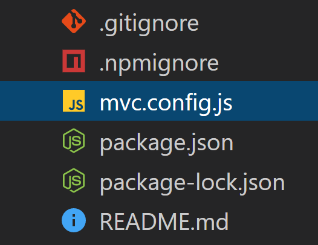

# instant-mvc
Create an mvc frame-work in an instant

## Getting Started
Three steps!
* Installation `npm install instant-mvc --save-dev`
* Create a mvc.config.js file
* Run the command line utility `npx instant-mvc` 
### That's it! get back to building the app.

### Inside the mvc.config.js
Create a mvc.config.js file in the root directory


Add this code to the mvc.config.js
```
module.exports = {
    routes: {}
}
```
You will define your routes here as an object.

##### Defining a route
You define a route as a key:value pair that takes on the form: `<route path>:<method>`
Defining a 'GET' route at '/api/posts' would look like: `'/api/posts':'GET'`

##### multiple methods to a route
For multiple methods, use an array: `'/api/posts':['GET','POST','DELETE']`

##### Adding controllers to a method
To add a controller to a REST method, use an array
`[<method>,<controller>]`

Example:
```
'/api/posts':[
    ['GET','getAllPosts'],
    ['POST','createPost'],
]
```
##### Possible issues
If only adding one `[<method>,<controller>]` to a route, make sure to define this as an Array of Arrays. Otherwise stranger things will occur.

Explicity, like this:
```
'/api/posts':[
    ['GET','getAllPosts'],
]
```

##### Putting it all together
Here's an example config
```
module.exports = {
    routes:{
        '/home':'index.html',
        '/login':'login.html',
        '/dashboard':'dashboard.html',
        '/api/posts':[
            ['GET','getAllPosts'],
            ['POST','createPost'],
        ],
        '/api/posts/:id':[
            ['GET','findPostById'],
            ['DELETE','deletePost'],
            ['PATCH','updatePost'],
        ],
        '/api/user':[
            ['POST','createUser'],
        ],
        '/api/user/:id':[
            ['GET','findUserById'],
            ['DELETE','deleteUser'],
            ['PATCH','updateUser'],
        ],
        '/api/user/VIP':[
            ['GET','getAllVIPS'],
            ['POST','createVIP'],
        ],
        '/api/user/VIP/:id':[
            ['GET','findVIPById'],
            ['DELETE','deleteVIP'],
            ['PATCH','updateVIP'],
        ],
    }
}
```

### Running instant-mvc
Once a mvc.config.js file has been set up
run `npx instant-mvc`

This will:
* Add a routes directory with all routes hooked to controllers (if defined that way).
* Add a controllers directory with a controller framework ready to add code to.
* Add a server.js file that: 
  * uses compression
  * has cors configured
  * is set up for data parsing
  * initialises env variables
  * hooked to your routes
  * starts a server with `npm start`


## Controllers directory
When these directories are set up, they contain an index file that autobundles all controllers and models into an object. If you want to add or remove controllers/models. Simple add and removes files. The exported object will automatically contain these files for you.

### Config Options
To configure extra options, add them as key:value pairs to the mvc.config.js file

All config options:
* buildPath: path from the root to where static assets should be served from
* htmlPath: path from the root to where html should be served from

## Frameworks 
instant-mvc aims to effortlessly connect an mvc framework to your prefered JS framework.

### React
Currently v0.3.1 supports create-react-app if housed in a 'client' folder. Instant-mvc will autoDetect React if it's under 'client' and configure your routes to reference everything from the build directory.

#### React quick start
From scratch, A create-react-app with a server:
* Make a new directory
* `npx create-react-app client`
* `npm init`
* `npm install instant-mvc`
* Create an mvc.config.js file with your routes and controllers.
* `npx instant-mvc`
* `npm install` Necessary step, the package.json file has been updated.
* `npm start` run the app!

That's it! You'll have a react app, with routes, with controllers, with a bells and whistles server running on localhost:3001. Neat huh?

#### React Specific Information
If using React Router (we recommend that you do), then there's no need to define a default for serving the index. we take care of this to.

If not using React Router, then simply serve up html files as you normally would, instant-mvc knows to serve these from `./client/build/<fileName>.html`

## Issues

## Contributing

## License


